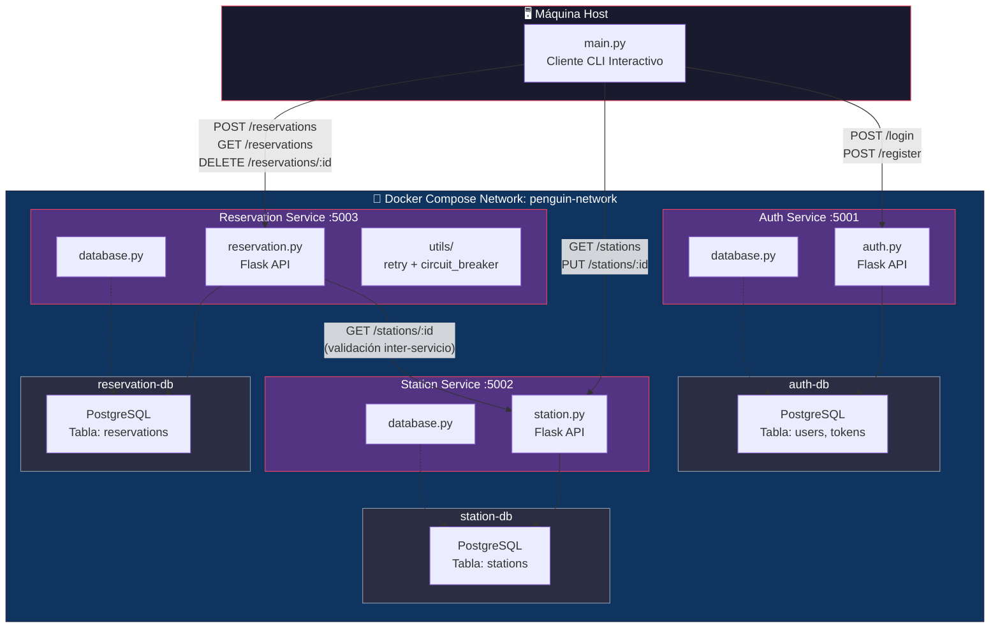
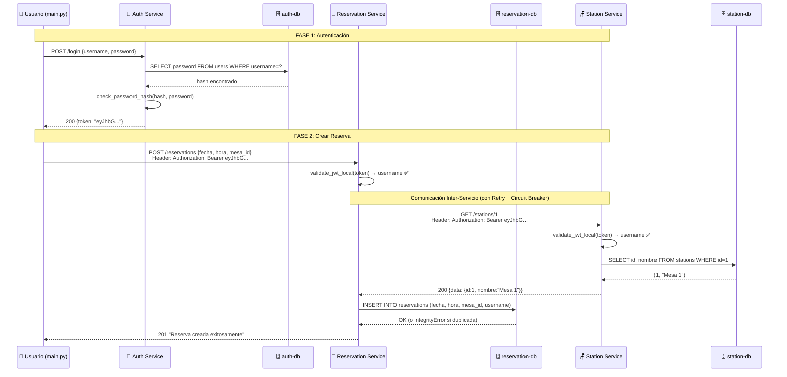
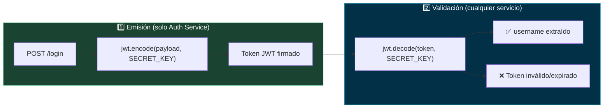
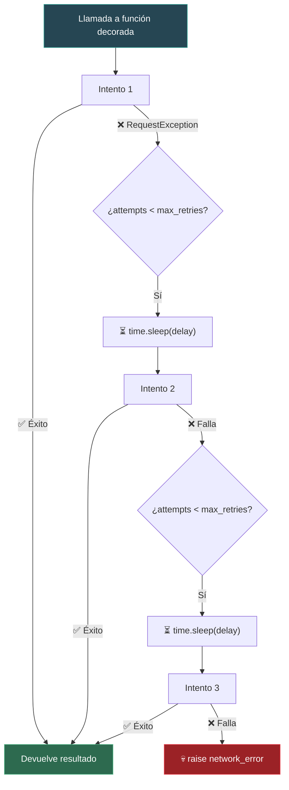
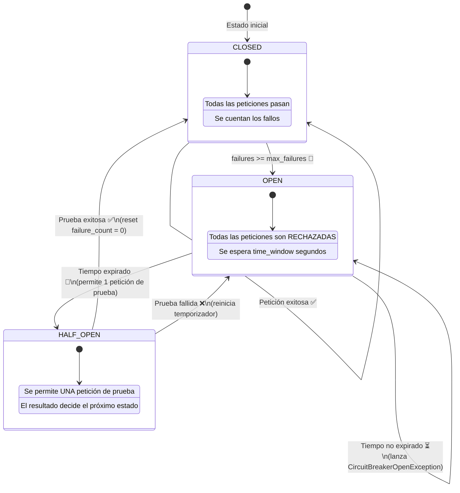
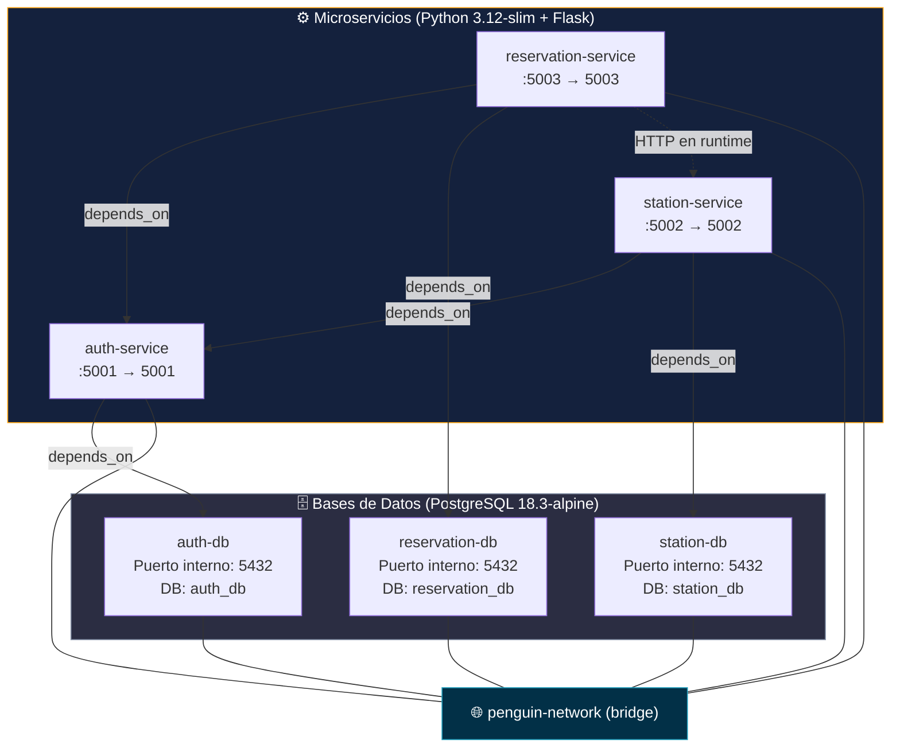
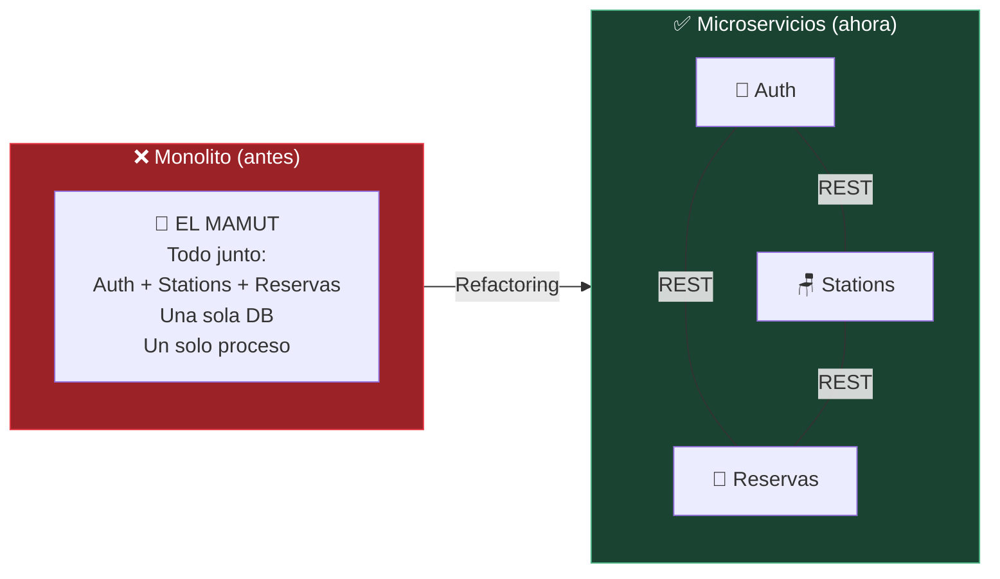
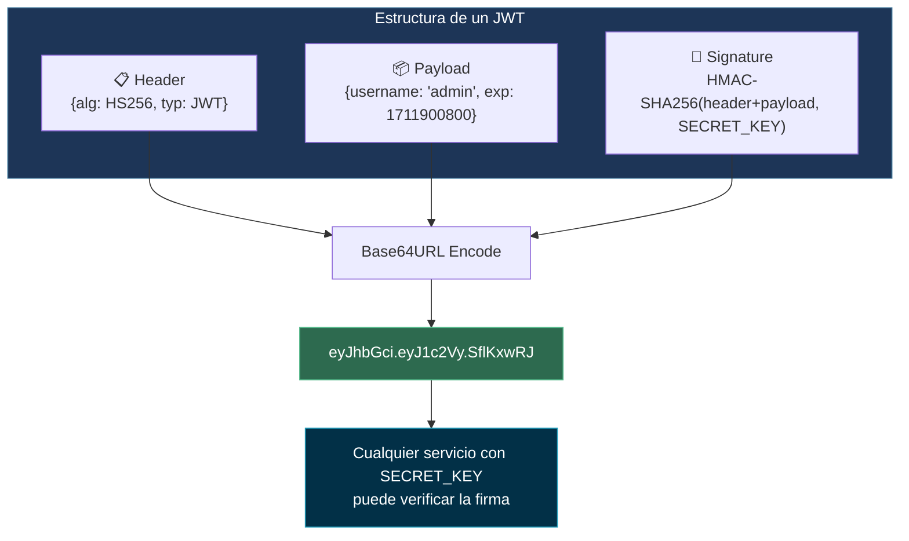
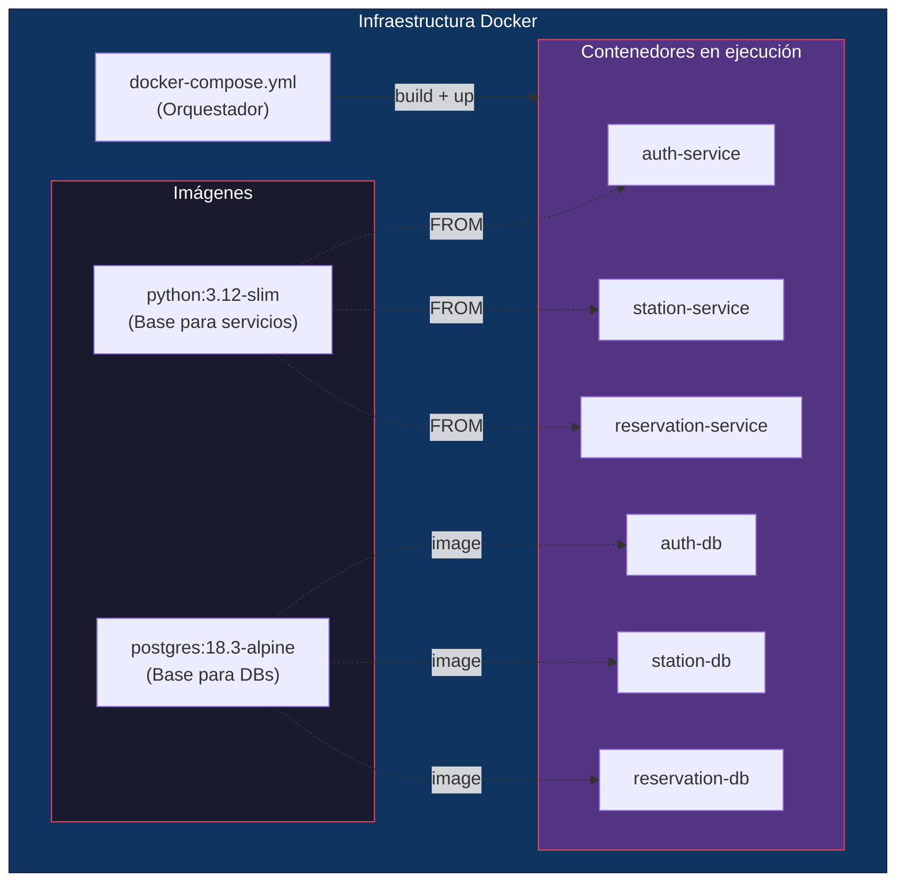
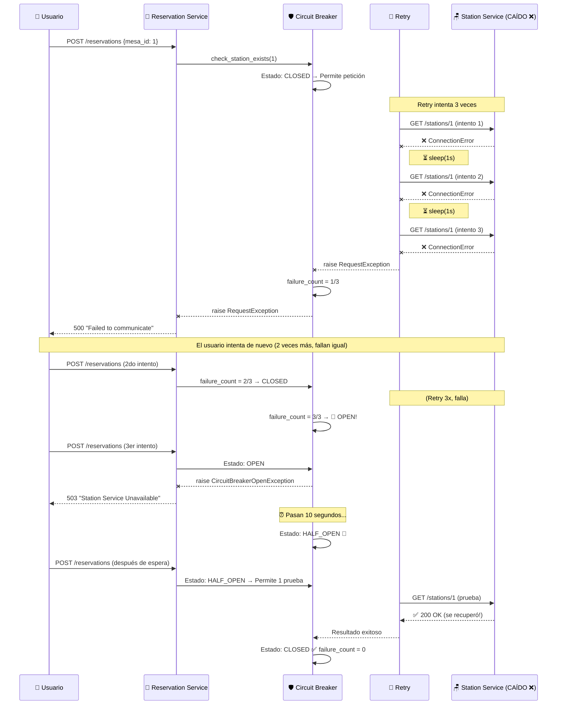

# 🐧 Documentación Profesional Completa — Penguin Academy: Sistema de Reservas

> **Autor:** Edgar Vega (Da21nny) — 2026  
> **Stack:** Python · Flask · PostgreSQL · Docker · JWT · Patrones de Resiliencia

---

## 📑 Tabla de Contenidos

1. [Visión General del Proyecto](#1-visión-general-del-proyecto)
2. [Estructura de Carpetas](#2-estructura-de-carpetas)
3. [Arquitectura del Sistema (Diagrama)](#3-arquitectura-del-sistema)
4. [Flujo General de una Petición (Diagrama de Secuencia)](#4-flujo-general-de-una-petición)
5. [Explicación Detallada por Archivo](#5-explicación-detallada-por-archivo)
   - 5.1 [main.py — Cliente Interactivo](#51-mainpy--cliente-interactivo)
   - 5.2 [Auth Service](#52-auth-service)
   - 5.3 [Station Service](#53-station-service)
   - 5.4 [Reservation Service](#54-reservation-service)
   - 5.5 [Utils — Patrones de Resiliencia](#55-utils--patrones-de-resiliencia)
   - 5.6 [Dockerfiles](#56-dockerfiles)
   - 5.7 [docker-compose.yml](#57-docker-composeyml)
   - 5.8 [Archivos de Configuración](#58-archivos-de-configuración)
6. [Conceptos Profesionales Aplicados](#6-conceptos-profesionales-aplicados)
7. [Flujo de los Patrones de Resiliencia (Diagrama)](#7-flujo-de-los-patrones-de-resiliencia)
8. [Tabla de Endpoints REST](#8-tabla-de-endpoints-rest)
9. [Cumplimiento de Requisitos del Challenge](#9-cumplimiento-de-requisitos)

---

## 1. Visión General del Proyecto

El proyecto es un **sistema distribuido de reservas de estaciones de evaluación** construido con arquitectura de microservicios. Reemplaza un sistema monolítico ficticio llamado "El Mamut" con tres servicios independientes que se comunican por HTTP/REST, cada uno con su propia base de datos PostgreSQL.

**¿Qué hace el sistema?**
- Un usuario se **registra** y luego **inicia sesión** (recibe un token JWT)
- Con ese token puede **ver las mesas** (estaciones) de evaluación disponibles
- Puede **crear reservas** para una fecha, hora y mesa específica
- Puede **editar nombres de mesas** y **eliminar reservas**
- El sistema garantiza que **no existan reservas duplicadas** (misma fecha + hora + mesa)

---

## 2. Estructura de Carpetas

```text
The_Huddle_Challenge_7_CodePro_4/
│
├── docker-compose.yml          # Orquestador: levanta TODOS los contenedores
├── main.py                     # Cliente CLI interactivo (corre FUERA de Docker)
├── requirements.txt            # Dependencias del cliente (solo 'requests')
├── README.md                   # Documentación general del proyecto
├── .dockerignore               # Archivos excluidos del contexto Docker
├── .gitignore                  # Archivos excluidos del repositorio Git
│
├── docs/
│   ├── challenge.txt           # Enunciado original del desafío
│   └── docs.txt                # Documentación complementaria del challenge
│
└── services/                   # ← NÚCLEO DEL SISTEMA
    │
    ├── auth_service/           # Microservicio de Autenticación
    │   ├── auth.py             # API Flask: login, register, verify
    │   ├── database.py         # Conexión + inicialización de PostgreSQL
    │   ├── Dockerfile          # Imagen Docker del servicio
    │   └── requirements.txt    # Dependencias Python del servicio
    │
    ├── station_service/        # Microservicio de Estaciones (Mesas)
    │   ├── station.py          # API Flask: CRUD de estaciones
    │   ├── database.py         # Conexión + inicialización + seed de datos
    │   ├── Dockerfile          # Imagen Docker del servicio
    │   └── requirements.txt    # Dependencias Python del servicio
    │
    ├── reservation_service/    # Microservicio de Reservas
    │   ├── reservation.py      # API Flask: crear, listar, eliminar reservas
    │   ├── database.py         # Conexión + inicialización con constraint UNIQUE
    │   ├── Dockerfile          # Imagen Docker del servicio
    │   └── requirements.txt    # Dependencias Python del servicio
    │
    └── utils/                  # Utilidades compartidas (patrones de resiliencia)
        ├── __init__.py         # Convierte la carpeta en un paquete Python
        ├── circuit_breaker.py  # Patrón Circuit Breaker (decorador)
        └── retry.py            # Patrón Retry (decorador)
```

> [!IMPORTANT]
> Los servicios viven dentro de Docker. El `main.py` es el **único componente que corre en la máquina host**, conectándose a los servicios mediante los puertos publicados (5001, 5002, 5003).

---

## 3. Arquitectura del Sistema



### Puntos clave de la arquitectura:

| Concepto | Implementación |
|---|---|
| **Cada servicio tiene su propia DB** | `auth-db`, `station-db`, `reservation-db` — bases aisladas |
| **Comunicación inter-servicio** | Solo `reservation → station` vía HTTP REST |
| **Autenticación descentralizada** | JWT validado localmente en cada servicio (sin llamar a `auth-service`) |
| **Red aislada** | Todos comparten `penguin-network` (bridge de Docker) |
| **Cliente fuera de Docker** | `main.py` se conecta por puertos publicados |

---

## 4. Flujo General de una Petición

### 4.1 Flujo de Login + Crear Reserva



### 4.2 Flujo de Autenticación JWT (Descentralizada)



> [!TIP]
> **¿Por qué es "descentralizada"?** Porque `station_service` y `reservation_service` **NO llaman a `auth_service`** para validar el token. Cada uno decodifica el JWT localmente usando la misma `SECRET_KEY` compartida. Esto elimina un punto de fallo y reduce latencia.

---

## 5. Explicación Detallada por Archivo

---

### 5.1 `main.py` — Cliente Interactivo

**Ubicación:** Raíz del proyecto  
**Rol:** Interfaz de usuario por consola (CLI) que consume los 3 microservicios

```python
AUTH_URL = os.getenv("AUTH_URL", "http://127.0.0.1:5001")
STATION_URL = os.getenv("STATION_URL", "http://127.0.0.1:5002")
RESERVATION_URL = os.getenv("RESERVATION_URL", "http://127.0.0.1:5003")
```

**Conceptos aplicados:**
- **Variables de entorno con fallback:** `os.getenv("VAR", "default")` permite configurar las URLs sin tocar código
- **Patrón de menú interactivo:** Dos bucles `while` — el primero para autenticación, el segundo para operaciones CRUD
- **Manejo de errores robusto:** Cada llamada HTTP está envuelta en `try/except` capturando `ConnectionError` y `JSONDecodeError`
- **Flujo de sesión:** El token se guarda en la variable `headers` y se pasa a TODAS las peticiones subsiguientes

**Estructura lógica:**
```
main()
├── Menú de Inicio (while not token)
│   ├── Opción 1: Login → POST /login → guarda token
│   ├── Opción 2: Register → POST /register
│   └── Opción 3: Salir
│
└── Menú Principal (while True, requiere token)
    ├── Opción 1: Ver mesas → GET /stations
    ├── Opción 2: Nueva reserva → POST /reservations
    ├── Opción 3: Ver reservas → GET /reservations
    ├── Opción 4: Editar mesa → PUT /stations/:id
    ├── Opción 5: Eliminar reserva → DELETE /reservations/:id
    └── Opción 6: Salir
```

---

### 5.2 Auth Service

#### 5.2.1 `services/auth_service/auth.py`

**Rol:** API Flask que gestiona autenticación de usuarios (registro, login, verificación de token)

| Endpoint | Método | Descripción |
|---|---|---|
| `/login` | POST | Recibe `{username, password}`, valida contra DB, devuelve JWT |
| `/register` | POST | Recibe `{username, password}`, hashea password, inserta en DB |
| `/verify` | GET | Valida un token JWT del header `Authorization` |

**Conceptos clave del archivo:**

1. **Hashing de contraseñas con Werkzeug:**
   ```python
   from werkzeug.security import generate_password_hash, check_password_hash
   ```
   - `generate_password_hash(password)` → Crea un hash seguro (bcrypt/scrypt) al registrar
   - `check_password_hash(stored_hash, password)` → Compara el hash almacenado con el password ingresado
   - **¿Por qué?** Las contraseñas NUNCA se almacenan en texto plano. Si la DB es comprometida, los hashes son irreversibles

2. **Generación de JWT:**
   ```python
   payload = {"username": username, "exp": datetime.datetime.utcnow() + datetime.timedelta(hours=1)}
   access_token = jwt.encode(payload, SECRET_KEY, algorithm="HS256")
   ```
   - El token contiene el `username` y una fecha de expiración (`exp`) de 1 hora
   - Se firma con `HS256` (HMAC-SHA256) usando la clave secreta compartida
   - **El token es autocontenido** — lleva toda la información necesaria para validarlo

3. **Manejo de duplicados con `IntegrityError`:**
   ```python
   except psycopg2.IntegrityError:
       return jsonify({"status": 409, "message": "El usuario ya existe"}), 409
   ```
   - La tabla `users` tiene `username` como `PRIMARY KEY`
   - PostgreSQL lanza `IntegrityError` si se intenta insertar un duplicado
   - Se captura y se devuelve HTTP 409 (Conflict)

#### 5.2.2 `services/auth_service/database.py`

**Rol:** Módulo de conexión y bootstrap de la base de datos de autenticación

```python
def get_connection():
    return psycopg2.connect(
        host=os.getenv("DB_HOST", "localhost"),
        database=os.getenv("DB_NAME", "auth_db"),
        user=os.getenv("DB_USER", "penguin"),
        password=os.getenv("DB_PASS", "secreto")
    )
```

**Conceptos aplicados:**

- **Configuración por variables de entorno:** Los 4 parámetros de conexión vienen de `os.getenv()` con valores por defecto. Esto cumple el principio de [12-Factor App](https://12factor.net/config)
- **Retry de inicialización:** El método `init_db()` intenta conectarse hasta 5 veces con pausas de 3 segundos. Esto es **crítico** porque Docker puede iniciar el servicio antes de que PostgreSQL esté listo
- **Esquema:**
  - Tabla `users`: `username TEXT PRIMARY KEY, password TEXT`
  - Tabla `tokens`: `token TEXT PRIMARY KEY, username TEXT` (creada pero no usada activamente ya que JWT es stateless)

---

### 5.3 Station Service

#### 5.3.1 `services/station_service/station.py`

**Rol:** API Flask para gestión de estaciones (mesas de evaluación)

| Endpoint | Método | Descripción |
|---|---|---|
| `/stations` | GET | Lista todas las estaciones |
| `/stations/<id>` | GET | Obtiene una estación por ID |
| `/stations/<id>` | PUT | Actualiza el nombre de una estación |

**Conceptos clave:**

1. **Validación JWT local (stateless):**
   ```python
   def validate_jwt_local(auth_header):
       token = auth_header.replace("Bearer ", "")
       payload = jwt.decode(token, SECRET_KEY, algorithms=["HS256"])
       return payload["username"]
   ```
   - No llama al `auth-service` — decodifica el JWT directamente
   - Usa la misma `SECRET_KEY` configurada por variable de entorno
   - Si el token expiró → `ExpiredSignatureError`, si es inválido → `InvalidTokenError`

2. **Patrón de verificación de afectación:**
   ```python
   if cursor.rowcount == 0:
       return jsonify({"status": 404, "message": f"La mesa {station_id} no existe"}), 404
   ```
   - Después de un `UPDATE`, se verifica `cursor.rowcount` para saber si realmente se modificó alguna fila
   - Si es 0, el ID no existía → se devuelve 404

#### 5.3.2 `services/station_service/database.py`

**Rol:** Conexión + inicialización con datos semilla (seed)

**Diferencia clave con los otros `database.py`:** Este módulo **siembra datos iniciales**:
```python
if cursor.fetchone()[0] == 0:  # Si la tabla está vacía
    cursor.execute("INSERT INTO stations (id, nombre) VALUES (1, 'Mesa 1')")
    cursor.execute("INSERT INTO stations (id, nombre) VALUES (2, 'Mesa 2')")
    cursor.execute("INSERT INTO stations (id, nombre) VALUES (3, 'Mesa 3')")
```
- Verifica con `SELECT COUNT(*)` si la tabla está vacía antes de insertar
- Esto evita duplicados si el contenedor se reinicia
- La tabla usa `id SERIAL PRIMARY KEY` (autoincremental de PostgreSQL)

---

### 5.4 Reservation Service

#### 5.4.1 `services/reservation_service/reservation.py`

**Rol:** API Flask para gestión de reservas — el servicio **más complejo** del sistema

| Endpoint | Método | Descripción |
|---|---|---|
| `/reservations` | GET | Lista todas las reservas |
| `/reservations` | POST | Crea una nueva reserva (valida con Station Service) |
| `/reservations/<id>` | DELETE | Elimina una reserva por ID |

**Este es el único servicio que realiza comunicación inter-servicio:**

```python
@circuit_breaker(max_failures=3, time_window=10)
@retry(max_retries=3, delay=1)
def check_station_exists(station_id, auth_header):
    return requests.get(f"{STATIONS_URL}/{station_id}",
                       headers={"Authorization": auth_header}, timeout=3)
```

**Conceptos clave:**

1. **Comunicación Inter-Servicio protegida:**
   - Antes de crear una reserva, llama a `GET /stations/:id` del Station Service
   - Esta llamada está protegida por **dos decoradores** (Circuit Breaker + Retry)
   - Si el Station Service cae → Retry reintenta 3 veces → Si sigue fallando → Circuit Breaker se abre

2. **Configuración de sys.path para imports:**
   ```python
   sys.path.append(os.path.abspath(os.path.join(os.path.dirname(__file__), '../')))
   from utils.retry import retry
   from utils.circuit_breaker import circuit_breaker, CircuitBreakerOpenException
   ```
   - Agrega el directorio padre (`services/`) al path de Python
   - Permite importar los módulos de `utils/` desde cualquier servicio

3. **Constraint UNIQUE compuesto:**
   - La tabla `reservations` tiene `UNIQUE(fecha, hora, mesa_id)`
   - PostgreSQL rechaza automáticamente reservas duplicadas para la misma fecha+hora+mesa
   - Se captura como `psycopg2.IntegrityError` → HTTP 409

4. **Manejo de errores diferenciado:**
   ```python
   except CircuitBreakerOpenException as cb_error:
       return jsonify({"status": 503, "message": f"Station Service Unavailable"}), 503
   except requests.exceptions.RequestException:
       return jsonify({"status": 500, "message": "Failed to communicate"}), 500
   ```
   - **503** si el Circuit Breaker está abierto (servicio sobrecargado)
   - **500** si es un fallo de red genérico

#### 5.4.2 `services/reservation_service/database.py`

**Esquema de la tabla:**
```sql
CREATE TABLE IF NOT EXISTS reservations (
    id SERIAL PRIMARY KEY,
    fecha TEXT,
    hora TEXT,
    mesa_id INTEGER,
    username TEXT,
    UNIQUE(fecha, hora, mesa_id)  -- ← Constraint clave para exclusividad
)
```

---

### 5.5 Utils — Patrones de Resiliencia

#### 5.5.1 `services/utils/__init__.py`

```python
# Archivo necesario para que Python trate a 'utils' como un paquete
```
- Sin este archivo, Python no reconocería `utils/` como un paquete importable
- Permite hacer `from utils.retry import retry`

#### 5.5.2 `services/utils/retry.py` — Patrón Retry

**¿Qué es?** Un decorador que re-ejecuta una función automáticamente si falla por errores de red.



**Implementación (simplificada):**
```python
def retry(max_retries=3, delay=2):
    def decorator(func):
        @wraps(func)
        def wrapper(*args, **kwargs):
            attempts = 0
            while attempts < max_retries:
                try:
                    return func(*args, **kwargs)          # Éxito → sale inmediatamente
                except requests.exceptions.RequestException:
                    attempts += 1
                    if attempts >= max_retries:
                        raise                              # Agotó intentos → lanza error
                    time.sleep(delay)                      # Espera antes de reintentar
        return wrapper
    return decorator
```

**Conceptos aplicados:**
- **Decorator Pattern:** Función que envuelve otra función para agregar comportamiento
- **`@wraps(func)`:** Preserva el nombre y docstring de la función original (introspección)
- **Solo captura `RequestException`:** No captura errores de lógica, solo de red — esto es intencional para no enmascarar bugs

#### 5.5.3 `services/utils/circuit_breaker.py` — Patrón Circuit Breaker

**¿Qué es?** Un mecanismo de protección que **deja de enviar peticiones** a un servicio que está fallando, evitando sobrecargarlo y permitiendo que se recupere.

**Máquina de estados:**



**Variables de estado (closure):**
```python
failure_count = 0          # Cuántas veces ha fallado consecutivamente
last_failure_time = 0.0    # Timestamp del último fallo
circuit_state = "CLOSED"   # Estado actual: CLOSED | OPEN | HALF_OPEN
```

> [!NOTE]
> Las variables de estado viven en el **closure** del decorador (no en una clase). Se usa `nonlocal` para poder modificarlas desde la función `wrapper`. Esto significa que el estado persiste **en memoria** durante toda la vida del proceso.

**¿Cómo interactúan Retry + Circuit Breaker?**

En `reservation.py`, los decoradores se apilan así:
```python
@circuit_breaker(max_failures=3, time_window=10)   # ← Se ejecuta PRIMERO (capa exterior)
@retry(max_retries=3, delay=1)                      # ← Se ejecuta SEGUNDO (capa interior)
def check_station_exists(station_id, auth_header):
    ...
```

**Orden de ejecución al llamar `check_station_exists()`:**

```
circuit_breaker.wrapper()          ← 1. Verifica si el circuito está abierto
   └── retry.wrapper()             ← 2. Si está cerrado, entra al retry
          └── func()               ← 3. Ejecuta la función real
          └── [fallo] → reintenta  ← 4. Si falla, retry reintenta
   └── [si retry agota intentos]   ← 5. El error sube al circuit breaker
   └── circuit_breaker cuenta fallo ← 6. Incrementa failure_count
```

---

### 5.6 Dockerfiles

Los tres servicios comparten el mismo patrón de Dockerfile. Aquí se explica usando `auth_service` como ejemplo:

```dockerfile
FROM python:3.12-slim          # Imagen base Python ligera (~150MB vs ~900MB de la full)
WORKDIR /app                   # Establece el directorio de trabajo dentro del contenedor

ENV PYTHONDONTWRITEBYTECODE=1  # Evita crear archivos .pyc (ahorra espacio y disco I/O)
ENV PYTHONUNBUFFERED=1         # Desactiva buffering de stdout (logs en tiempo real)

COPY services/auth_service/requirements.txt ./     # Copia SOLO requirements primero (cache de capas)
RUN pip install --no-cache-dir -r requirements.txt # Instala dependencias sin guardar cache pip

COPY services/auth_service ./services/auth_service # Copia el código del servicio
COPY services/utils ./services/utils               # Copia las utilidades compartidas

EXPOSE 5001                                        # Documenta el puerto (informativo)
CMD ["python", "-u", "services/auth_service/auth.py"]  # Comando de inicio
```

**Conceptos aplicados:**

| Concepto | Explicación |
|---|---|
| **Multi-stage COPY** | Se copia `requirements.txt` antes que el código. Esto aprovecha el caché de capas Docker: si las dependencias no cambian, esa capa se reutiliza (build más rápido) |
| **`--no-cache-dir`** | No guarda los paquetes descargados en caché pip → imagen más pequeña |
| **`PYTHONUNBUFFERED=1`** | Sin esto, los `print()` de Python se bufferean y no se ven en `docker logs` hasta que el buffer se llena |
| **`python:3.12-slim`** | Variante minimalista de la imagen: incluye Python pero sin herramientas de compilación extras |
| **`COPY services/utils`** | Cada servicio copia las utilidades compartidas, manteniendo la independencia de cada imagen |

**Variaciones entre Dockerfiles:**

| Servicio | Puerto | Archivo de entrada |
|---|---|---|
| auth_service | `EXPOSE 5001` | `services/auth_service/auth.py` |
| station_service | `EXPOSE 5002` | `services/station_service/station.py` |
| reservation_service | `EXPOSE 5003` | `services/reservation_service/reservation.py` |

---

### 5.7 `docker-compose.yml`

**Rol:** Orquestador que define y levanta toda la infraestructura con un solo comando



**Estructura del archivo explicada:**

**Bases de datos (3 contenedores PostgreSQL):**
```yaml
auth-db:
  image: postgres:18.3-alpine    # Imagen oficial PostgreSQL, variante Alpine (ligera)
  container_name: auth-db         # Nombre fijo del contenedor
  environment:
    - POSTGRES_USER=penguin       # Usuario de la DB
    - POSTGRES_PASSWORD=secreto   # Password de la DB
    - POSTGRES_DB=auth_db         # Nombre de la base de datos a crear
  networks:
    - penguin-network             # Conectado a la red compartida
```

**Servicios (3 contenedores Flask):**
```yaml
auth-service:
  build:
    context: .                           # El contexto del build es la RAÍZ del proyecto
    dockerfile: services/auth_service/Dockerfile  # Path al Dockerfile
  ports:
    - "5001:5001"                        # Publica puerto del host → contenedor
  environment:
    - DB_HOST=auth-db                    # Referencia al contenedor de DB por nombre
    - JWT_SECRET=super_secret_penguin_key # Clave secreta compartida entre servicios
  depends_on:
    - auth-db                            # Inicia DESPUÉS de auth-db
  volumes:
    - ./services/auth_service:/app/services/auth_service  # Hot-reload en desarrollo
```

**Conceptos aplicados:**

| Concepto | Detalle |
|---|---|
| **Service Discovery por nombre** | `DB_HOST=auth-db` funciona porque Docker DNS resuelve nombres de contenedores en la misma red |
| **`depends_on`** | Define orden de arranque, pero NO espera a que la DB esté "ready" (por eso existe el retry en `init_db`) |
| **`volumes` bind mount** | `./services/auth_service:/app/...` mapea el código local al contenedor → cambios se reflejan sin rebuild |
| **`context: .`** | El build context es la raíz para que `COPY services/utils` funcione (necesita acceso al directorio `utils/`) |
| **Red bridge** | `penguin-network` permite comunicación entre contenedores por nombre, aislada del host |

---

### 5.8 Archivos de Configuración

#### `.dockerignore`
```
__pycache__/    # Bytecode compilado de Python
*.db            # Bases de datos SQLite legacy
.git            # Historial Git (pesado, innecesario en la imagen)
.gitignore      # Configuración Git
.env            # Variables de entorno locales (no deben ir a la imagen)
.vscode/        # Configuración del editor
README.md       # Documentación (no necesaria en runtime)
docs/           # Carpeta de documentos del challenge
main.py         # Cliente CLI (no corre en Docker)
```

> [!TIP]
> El `.dockerignore` reduce drásticamente el tamaño del "build context" que Docker envía al daemon. Menos archivos = builds más rápidos.

#### `.gitignore`
Excluye del repositorio Git: bytecode Python (`__pycache__`), bases de datos locales (`.db`), entornos virtuales (`.venv`), y archivos del sistema operativo.

#### `requirements.txt` (raíz)
```
flask             # Framework web para microservicios
requests          # Cliente HTTP para el CLI
psycopg2-binary   # Driver PostgreSQL (precompilado)
PyJWT             # Librería para generar/validar JSON Web Tokens
```

---

## 6. Conceptos Profesionales Aplicados

### 6.1 Arquitectura de Microservicios



| Principio | Cómo se aplica |
|---|---|
| **Responsabilidad única** | Auth solo autentica, Station solo gestiona mesas, Reservation solo gestiona reservas |
| **Base de datos por servicio** | 3 bases PostgreSQL independientes. No comparten tablas |
| **Comunicación por API** | Los servicios se "hablan" solo por HTTP REST |
| **Despliegue independiente** | Cada servicio tiene su propio Dockerfile y puede rebuildearse sin afectar a los otros |
| **Tolerancia a fallos** | Si Station Service cae, Auth y las reservas existentes siguen funcionando |

### 6.2 API REST (Representational State Transfer)

Las APIs siguen las convenciones RESTful:

| Verbo HTTP | Significado | Ejemplo |
|---|---|---|
| `GET` | Leer datos | `GET /stations` → Lista todas las mesas |
| `POST` | Crear datos | `POST /reservations` → Crea una reserva |
| `PUT` | Actualizar datos | `PUT /stations/1` → Renombra mesa 1 |
| `DELETE` | Eliminar datos | `DELETE /reservations/3` → Elimina reserva 3 |

**Códigos de respuesta usados:**

| Código | Significado | Uso en el proyecto |
|---|---|---|
| `200` | OK | Operación exitosa (GET, PUT, DELETE) |
| `201` | Created | Recurso creado exitosamente (POST) |
| `400` | Bad Request | Faltan campos obligatorios |
| `401` | Unauthorized | Token JWT inválido o ausente |
| `404` | Not Found | Recurso no encontrado (mesa, reserva) |
| `409` | Conflict | Duplicado (usuario ya existe, reserva ya existe) |
| `500` | Server Error | Fallo de comunicación inter-servicio |
| `503` | Service Unavailable | Circuit Breaker abierto |

### 6.3 Autenticación con JWT (JSON Web Token)



**Ventajas en este proyecto:**
- **Stateless:** No se necesita una sesión en el servidor ni consultar una DB para validar
- **Descentralizado:** Cada servicio valida independientemente con la misma clave
- **Autocontenido:** El token lleva el `username` y la expiración embedidos
- **Seguro:** Firmado con HMAC-SHA256 — cualquier modificación invalida la firma

### 6.4 Dockerización y Contenedores



| Concepto Docker | Implementación |
|---|---|
| **Dockerfile** | Receta para construir la imagen de cada servicio |
| **docker-compose.yml** | Define los 6 contenedores y su configuración |
| **Network (bridge)** | `penguin-network` permite DNS interno entre contenedores |
| **Volumes** | Bind mounts para hot-reload en desarrollo |
| **Environment Variables** | Configuración inyectada sin hardcodear |
| **`depends_on`** | Orden de arranque (no readiness) |

### 6.5 PostgreSQL como Base de Datos

| Servicio | Base de Datos | Tablas |
|---|---|---|
| Auth Service | `auth_db` | `users(username PK, password)` + `tokens(token PK, username)` |
| Station Service | `station_db` | `stations(id SERIAL PK, nombre)` |
| Reservation Service | `reservation_db` | `reservations(id SERIAL PK, fecha, hora, mesa_id, username, UNIQUE(fecha,hora,mesa_id))` |

**Conceptos SQL aplicados:**
- `SERIAL PRIMARY KEY` → ID autoincremental
- `UNIQUE(fecha, hora, mesa_id)` → Constraint compuesto que garantiza exclusividad
- `TEXT PRIMARY KEY` → Clave primaria textual (username en users)
- `psycopg2` → Driver de PostgreSQL para Python (se usa `psycopg2-binary` que incluye libs precompiladas)

### 6.6 Patrones de Resiliencia

| Patrón | Propósito | Configuración |
|---|---|---|
| **Retry** | Reintentar automáticamente si un servicio falla de forma transitoria | 3 reintentos, 1 segundo entre cada uno |
| **Circuit Breaker** | Dejar de llamar a un servicio si está caído (proteger al sistema de cascadas) | 3 fallos máximos, ventana de 10 segundos |
| **Retry en init_db** | Esperar a que PostgreSQL esté listo al arrancar | 5 intentos, 3 segundos entre cada uno |

### 6.7 Principios de Clean Code

| Principio | Ejemplo en el proyecto |
|---|---|
| **Nombres descriptivos** | `check_station_exists()`, `validate_jwt_local()`, `reservation_date` |
| **Funciones pequeñas** | Cada endpoint es una función con una responsabilidad clara |
| **Comentarios explicativos** | Cada línea de código tiene un comentario en español |
| **No repetición (DRY)** | `utils/` contiene los patrones reutilizados por `reservation_service` |
| **Separation of Concerns** | `database.py` separado de la lógica de la API en cada servicio |
| **Configuración externalizada** | Variables de entorno para DB, puertos, JWT secret |

---

## 7. Flujo de los Patrones de Resiliencia

### Escenario: Station Service se cae durante una reserva



---

## 8. Tabla de Endpoints REST

### Auth Service (`:5001`)

| Método | Ruta | Body | Headers | Respuesta exitosa |
|---|---|---|---|---|
| `POST` | `/login` | `{"username":"x", "password":"y"}` | — | `200 {"token": "eyJ..."}` |
| `POST` | `/register` | `{"username":"x", "password":"y"}` | — | `201 {"message": "..."}` |
| `GET` | `/verify` | — | `Authorization: Bearer <token>` | `200 {"username": "x"}` |

### Station Service (`:5002`)

| Método | Ruta | Body | Headers | Respuesta exitosa |
|---|---|---|---|---|
| `GET` | `/stations` | — | `Authorization: Bearer <token>` | `200 {"data": [...]}` |
| `GET` | `/stations/:id` | — | `Authorization: Bearer <token>` | `200 {"data": {...}}` |
| `PUT` | `/stations/:id` | `{"nombre": "Nuevo Nombre"}` | `Authorization: Bearer <token>` | `200 {"message": "..."}` |

### Reservation Service (`:5003`)

| Método | Ruta | Body | Headers | Respuesta exitosa |
|---|---|---|---|---|
| `GET` | `/reservations` | — | `Authorization: Bearer <token>` | `200 {"data": [...]}` |
| `POST` | `/reservations` | `{"fecha":"x", "hora":"y", "mesa_id":1}` | `Authorization: Bearer <token>` | `201 {"message": "..."}` |
| `DELETE` | `/reservations/:id` | — | `Authorization: Bearer <token>` | `200 {"message": "..."}` |

---

## 9. Cumplimiento de Requisitos

| # | Requisito Obligatorio | Estado | Dónde se implementa |
|---|---|---|---|
| 1 | Al menos 3 microservicios con responsabilidades distintas | ✅ | `auth_service`, `station_service`, `reservation_service` |
| 2 | Cada uno con su propia API REST | ✅ | Cada servicio expone Flask con endpoints REST |
| 3 | Autenticación entre servicios | ✅ | JWT validado localmente en station y reservation |
| 4 | Bases de datos independientes | ✅ | 3 PostgreSQL: `auth-db`, `station-db`, `reservation-db` |
| 5 | Gestión de errores con resiliencia (Circuit Breaker, Retry) | ✅ | `utils/circuit_breaker.py`, `utils/retry.py` |
| 6 | Docker obligatorio por servicio | ✅ | 3 Dockerfiles individuales |
| 7 | Sistema levantable con `docker compose up` | ✅ | `docker-compose.yml` |
| 8 | Bases de datos en contenedores | ✅ | 3 contenedores `postgres:18.3-alpine` |
| 9 | Configuración por variables de entorno | ✅ | Todas las variables en `docker-compose.yml` environment |
| 10 | Nombres descriptivos / Clean Code | ✅ | Variables en inglés, comentarios en español |

| # | Bonus Opcional | Estado | Detalle |
|---|---|---|---|
| 1 | Fácilmente escalable | ✅ | Cada servicio puede escalarse independientemente con `docker-compose up --scale` |
| 2 | Diagramas de arquitectura | ✅ | Incluidos en esta documentación |
| 3 | Logs centralizados | ⬜ | No implementado (se usan `print()` por servicio) |

---

> [!NOTE]
> Este documento cubre la totalidad del proyecto: cada archivo, cada concepto, cada flujo de datos. Para ejecutar el sistema, simplemente ejecuta `docker-compose up --build -d` y luego `python main.py` en la máquina host.
